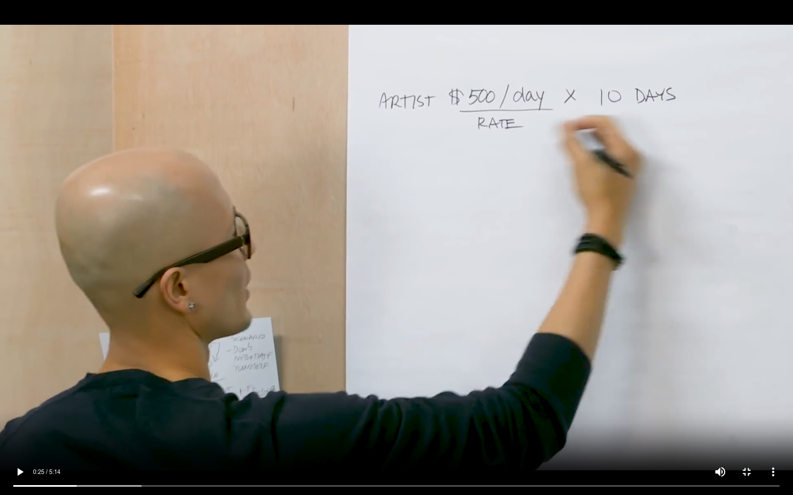

# Video Streaming Server

This is a Node.js application for streaming video content over HTTP using the Express.js framework. It allows you to efficiently serve large video files to clients while supporting partial content requests.



## Prerequisites

Before getting started, ensure you have the following dependencies installed on your system:

- Node.js: You can download it from [https://nodejs.org/](https://nodejs.org/).

## Installation

1. Clone this repository or download the source code.

   ```bash
   git clone https://github.com/thesmartcoder7/video-streaming-server.git
   ```

2. From here, navigate to the project directory

   ```bash
   cd video-streaming-server
   ```

3. Install the npm packages

   ```bash
   npm install
   ```

## Usage

Place your video file (e.g., Chris-Do.mp4) in the root directory of the project.

Start the server by running the following command:

```bash
node server.js
```

This will start the server, and you will see the message "Listening on port 8000!" in the console, indicating that the server is running.

To access the video stream, open a web browser and navigate to <http://localhost:8000/video>. You should be able to stream the video.
